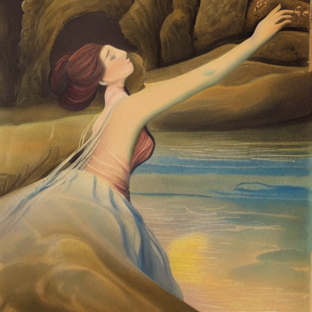
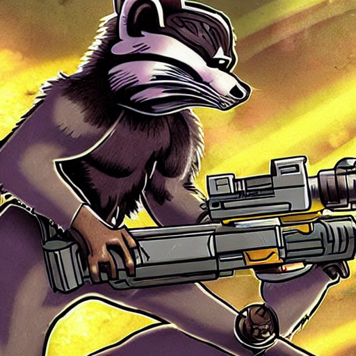

# Playing with stable diffusion

## What I had in mind before the trial

My objective was to be able to locally create an <b>ai generated drawing.</b>
This drawing would illustrate my first blog post.
As a result, the prompt I had in mind was:
<p style='text-align: center;'><i>Somebody writing his first blog post on github</i></p>
Obviously, the idea is that the drawing would match the prompt description.
Let's see how I have done it!

## The making of

### Getting the model: The Huggingface hub
First thing first, I went to huggingface to get the model. You need to log in (or create an account) and agree to the stable diffusion model license. 
<br>You can follow the link:
<br>[HuggingFace stable diffusion model](https://huggingface.co/CompVis/stable-diffusion-v1-4)

# Google Colab

It was such a nightmare (I just gave up) to get it working on my MacBook (Many errors as I didn't have PyTorch GPU already installed). 
As a result, I have done it using Google Colab.
<br>You just need to make sure you are using a GPU instance.
<br>To do so, you need to click the drop down menu near the connected button and select resources. Then, you can click on <i>change runtime type</i> and select the GPU flavored one.

<br>The code is the following one:
```markdown
!pip install --upgrade diffusers transformers scipy
!pip install ipywidgets==7.7.1
!pip install huggingface_hub

from huggingface_hub import notebook_login

notebook_login()
```

You will have to enter your Hugging Face token available under <i>settings</i> and then <i>Access Tokens</i> in your Hugging Face account (directly in the Hugging Face website).

Then, the code to generate your images is the following one:
```markdown
%%time
import torch
from torch import autocast
from diffusers import StableDiffusionPipeline

model_id = "CompVis/stable-diffusion-v1-4"
device = "cuda"
prompt = "somebody writing his first blog post on Github"

images = []

with autocast("cuda"):
    for i in range(10):
        image = pipe(prompt, guidance_scale=7.5).images[0]  
        images.append(image)

for i, image in enumerate(images):
    image.save(f"first_blog_post_github_{i}.png")
```
## The result

I selected this image out of the 10 I generated.
<br>

<br> Some were simply weird, here is an example:


## Let's have fun

Then, I just played around.
<br>Here is a curated selection:
<p style='text-align: center;'>Beautiful painting of a lady dreaming of a river and a mountain on the moon</p>


<br><br>
<p style='text-align: center;'>A sci-fi world with high technologies, ai robots and flying cars</p>


<br><br>
<p style='text-align: center;'>A racoon fighting aliens with a blaster gun</p>




